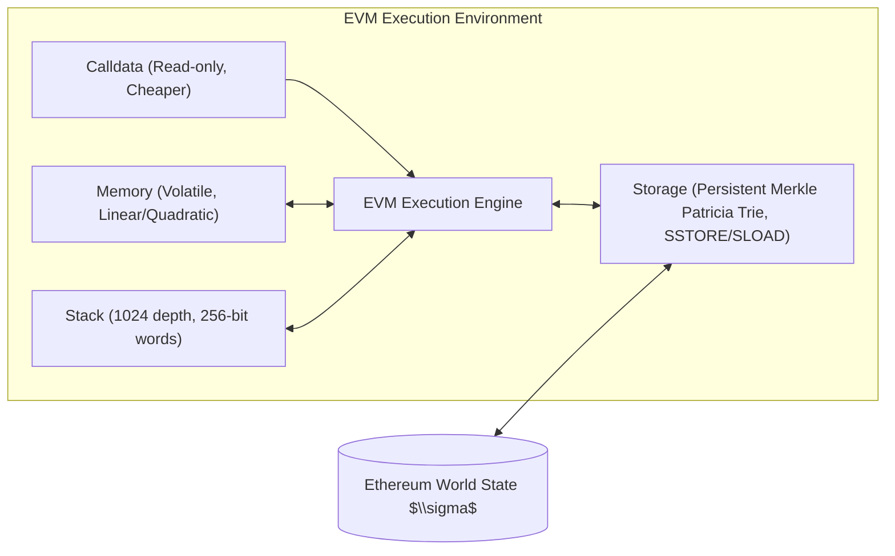
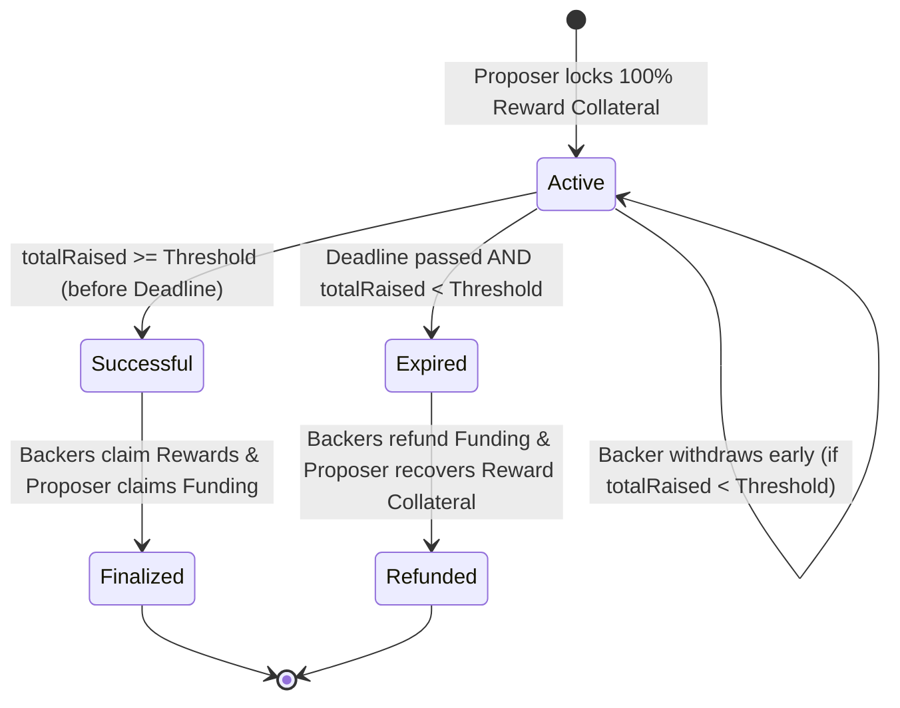
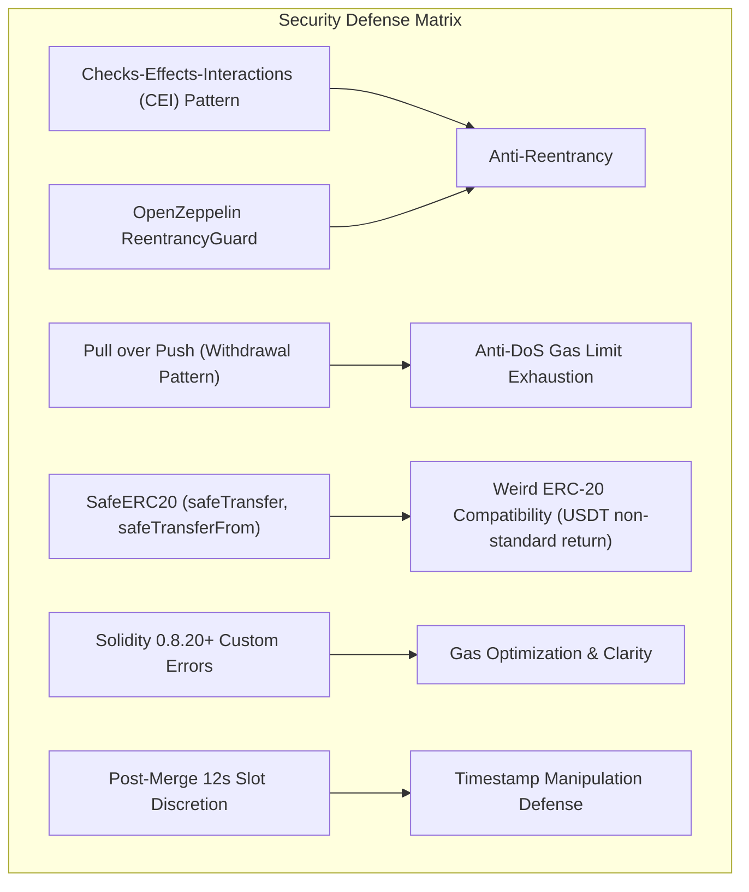

# Crowdfunding Protocol: Comprehensive Theoretical Foundations, Academic Context & Implementation Blueprint

**Course:** Blockchain, Distributed and Decentralised Systems (INF0422)  
**Institution:** Università degli Studi di Torino (UniTO) — Corso di Laurea in Informatica  
**Academic Year:** 2025/2026  
**Instructors:** Prof. Andrea Bracciali, Prof. Claudio Schifanella  
**Master Repository:** `unito-blockchain-25-26`  
**Subproject Workspace:** `crowdfunding-protocol`  

---

## Executive Summary

This report delivers an exhaustive, master-level theoretical treatise, architectural specification, and actionable implementation roadmap for the **Crowdfunding Protocol** project.

The workspace is part of the dual-pillar curriculum of the UniTO Blockchain course:

1. **Section B (Bitcoin & Unspent Transaction Outputs - UTXO):** Implemented in `payment-communities`, focusing on off-chain micropayment channels, HTLCs, Taproot/Schnorr scripts, and state machines over a stack-based, non-Turing complete execution environment.
2. **Section S (Ethereum & Smart Contracts - EVM):** Implemented in `crowdfunding-protocol`, focusing on account-based stateful computation, the Ethereum Virtual Machine (EVM), programmable escrows, game-theoretic assurance contracts ("All-or-Nothing"), dual-token economic mechanics, and decentralized application (dApp) engineering.

The objective of this project for the final exam is to produce an **enterprise-grade, production-secure, verifiable decentralized protocol** in Solidity running on the EVM, accompanied by exhaustive unit/integration testing (100% branch/statement coverage), Sepolia testnet deployment, and a Web3 decentralized user interface.

---

## 1. Academic Context & Master Repository Architecture

### 1.1 The INF0422 Educational Pedagogy

The course *Blockchain, Distributed and Decentralised Systems* at UniTO bridges foundational distributed systems theory with real-world cryptographic ledger engineering. The curriculum is split into two complementary paradigms:

| Metric / Dimension | Section B: Bitcoin (`payment-communities`) | Section S: Ethereum (`crowdfunding-protocol`) |
| :--- | :--- | :--- |
| **Ledger Model** | UTXO (Unspent Transaction Output) Graph | Account-Based State Trie (World State $\sigma$) |
| **Execution Engine** | Forth-like Stack Machine (Bitcoin Script) | Register/Stack hybrid virtual machine (EVM) |
| **Computational Power** | Intentionally Non-Turing Complete (Decidable, bounded) | Turing Complete (Gas-metered, unbounded state) |
| **State Storage** | Ephemeral evaluation; state resides in unspent outputs | Persistent storage slots ($2^{256}$ keys per contract account) |
| **L2 / Scaling Approach** | State channels, HTLC multi-hop networks (Lightning BOLT) | Rollups (Optimistic/ZK), modular execution layers |
| **Core Exam Artifact** | Multi-hop micropayment routing daemon & Taproot scripts | All-or-Nothing dual-token smart contract protocol & dApp |

### 1.2 Master Repository Topology

The master repository `unito-blockchain-25-26` unifies both modules via Git submodules:

```text
unito-blockchain-25-26/ (Master Repository)
├── payment-communities/        # Section B: Bitcoin L2 Lightning / Taproot / PTLC / Eltoo
│   ├── docs/                   # Architectural Decision Records (ADRs), theory, reports
│   ├── src/                    # Python async daemons, bitcoinlib wrappers, script engine
│   └── tests/                  # Regtest containerized tests
├── crowdfunding-protocol/       # Section S: Ethereum All-or-Nothing Smart Contracts & UI
│   ├── contracts/              # Solidity Smart Contracts (EVM)
│   ├── test/                   # Hardhat TypeScript testing suite
│   ├── scripts/                # Deployment & verification scripts
│   ├── frontend/               # Web3 dApp (React/Vite/Ethers.js)
│   └── docs/                   # Protocol specifications & formal models
├── .gitmodules                 # Submodule tracking configuration
└── README.md                   # Master syllabus & setup guide
```

---

## 2. Deep Theoretical Foundations

### 2.1 The Ethereum Virtual Machine (EVM) State Machine Model

In Ethereum, the blockchain is formally defined as a **transaction-based state machine**. The global state $\sigma$ is a mapping between 160-bit account addresses and account states:
$$\sigma: \text{Address} \to \text{Account}$$

Where an account state $A$ comprises four fields:
$$A = (\text{nonce}, \text{balance}, \text{storageRoot}, \text{codeHash})$$

Given a current state $\sigma_t$ and a transaction $T$, the state transition function $\Upsilon$ deterministically computes the next state $\sigma_{t+1}$:
$$\sigma_{t+1} = \Upsilon(\sigma_t, T)$$

#### Storage Slots, Memory, and Calldata

When implementing the Crowdfunding Protocol, understanding EVM memory tiers is paramount for security and gas optimization:

1. **Storage:** A persistent key-value mapping of $2^{256} \to 2^{256}$ words (32 bytes each), backed by a Merkle Patricia Trie. Storage writes (`SSTORE`) are extremely expensive (up to 20,000 gas for uninitialized slots, 2,900 gas for warm initialized slots, 5,000 for warm writes under EIP-2929). State variables like balances and campaign status reside here.
2. **Memory:** Volatile, byte-addressable array cleared between external function calls. Gas cost scales quadratically after 724 bytes ($\text{gas} = \text{words} \times 3 + \frac{\text{words}^2}{512}$).
3. **Calldata:** Immutable, read-only byte array containing transaction payload arguments. Reading from calldata (`CALLDATALOAD`) costs only 3 gas, making it optimal for external function parameters.



---

### 2.2 Microeconomics & Mechanism Design: "All-or-Nothing" Assurance Contracts

Crowdfunding protocols address a classic market failure in economics: the **Public Goods Provision Problem** and the **Free-Rider Dilemma**.

#### The Free-Rider Dilemma & Coordination Failure

When a project requires a high fixed capital cost $C$ (the threshold) to produce a good or deliver a product, individual backers face a dilemma:

- If Backer $i$ contributes, but the aggregate funding falls short ($F_{\text{total}} < C$), the project cannot be realized. In a naive "Keep-It-All" model (like GoFundMe or flexible funding Indiegogo), the proposer pockets the inadequate funds, and backers receive zero return—a complete loss of capital.
- Consequently, rational actors anticipate failure and choose to withhold funding, causing viable projects to fail.

#### The Assurance Contract (Provision Point Mechanism)

Formulated by economists (Bagnoli & Lipman, 1989), an **Assurance Contract** eliminates this failure mode by binding contributions to a **provision point (Threshold $T$)**:

- If total contributions $F \ge T$ within time window $[0, t_{\text{deadline}}]$, the contract executes: goods/rewards are produced, and funds are disbursed to the proposer.
- If total contributions $F < T$ when $t > t_{\text{deadline}}$, the contract aborts: 100% of contributions are refunded to backers.



#### Dominant Strategy Equilibrium

Under the All-or-Nothing model, contributing becomes a weakly dominant strategy for individuals who value the project at or above their pledge cost, because the downside risk of contributing to an underfunded project is mathematically reduced to the opportunity cost of capital lockup.

#### Disintermediation of Trusted Third Parties

Centralized platforms (e.g. Kickstarter) act as trusted escrows but charge substantial rent (5% platform fee + 3–5% payment processing fee), enforce opaque custodial control, and present single points of failure (censorship, account freezes, cross-border payment exclusion). A Solidity smart contract replaces the intermediary with deterministic code execution.

---

### 2.3 Dual-Token Architecture & Mathematical Precision

The protocol manages two distinct ERC-20 token contracts:

1. **Funding Token ($F$):** The currency contributed by backers (e.g., standard ERC-20 such as DAI, USDC, or a project-specific stablecoin/utility token).
2. **Reward Token ($R$):** The project asset distributed to backers in return for their funding (e.g., governance token, utility voucher, equity-like token).

#### The Upfront Escrow Invariant (Collateralization)

In traditional crowdfunding, project creators often suffer from **Moral Hazard**: after receiving funds, they may fail to mint or distribute rewards.
To guarantee fairness, the protocol mandates **100% upfront collateralization**:
Upon creating a campaign with target threshold $T_{\text{funding}}$ and reward exchange rate $E_{\text{rate}}$, the proposer **must deposit into the campaign escrow**:
$$R_{\text{required}} = \frac{T_{\text{funding}} \times E_{\text{rate}}}{\text{RATE\_PRECISION}}$$

If the proposer does not possess or approve $R_{\text{required}}$, campaign creation fails atomically.

#### Fixed-Point Arithmetic & Precision Preservation

In the EVM, floating-point numbers do not exist. All calculations must use integer arithmetic. Integer division truncates towards zero:
$$\lfloor a / b \rfloor$$

If a naive formula performs division before multiplication:
$$\text{reward} = (\text{contribution} / \text{threshold}) \times \text{totalReward} \implies 0 \quad (\text{if contribution} < \text{threshold})$$

To prevent catastrophic precision loss, all calculations must adhere to **Multiplication Before Division** with an explicit scaling factor (e.g., $\text{SCALE} = 10^{18}$ or basis points $10^4$):
$$\text{rewardAmount} = \frac{\text{contribution} \times \text{rewardRate}}{\text{RATE\_PRECISION}}$$

#### Handling Token Decimals Discrepancies

Different ERC-20 tokens have different decimals (e.g., USDC has 6 decimals, DAI has 18 decimals, WBTC has 8 decimals). The rate arithmetic must account for normalized decimal units:
$$\text{RewardAmount} = \frac{\text{Contribution} \times 10^{\text{decimals}(R)} \times \text{ExchangeMultiplier}}{10^{\text{decimals}(F)} \times \text{Precision}}$$

---

### 2.4 Formal Protocol Invariants

A verifiable protocol must uphold formal mathematical invariants at all times $t$:

#### 1. Conservation of Funding Value

At any point in time $t$, the contract's actual balance of Funding Tokens must equal the sum of unwithdrawn backer contributions:
$$\text{balanceOf}(F, \text{address}(\text{campaign})) \ge \sum_{i \in \text{Backers}} \text{contribution}_i$$

#### 2. Escrow Solvency Invariant

The contract's balance of Reward Tokens must always be sufficient to satisfy all potential reward claims:
$$\text{balanceOf}(R, \text{address}(\text{campaign})) \ge \sum_{i \in \text{Backers}} \text{calculateReward}(\text{contribution}_i)$$

#### 3. Threshold Monotonicity

Let $S_t$ be the campaign state. If $\text{totalRaised} \ge \text{Threshold}$ at timestamp $t \le \text{Deadline}$, the campaign permanently enters the `Successful` state. The state cannot revert to `Active` or `Expired`.

#### 4. All-or-Nothing Settlement Exclusivity

- If State = `Successful`:
  $$\text{Proposer Payout} = \text{totalRaised}, \quad \text{Backer } i \text{ Payout} = \text{reward}_i, \quad \text{Refunds} = 0$$
- If State = `Expired` (Failed):
  $$\text{Proposer Payout} = \text{depositedRewardTokens}, \quad \text{Backer } i \text{ Payout} = \text{contribution}_i, \quad \text{Reward Distribution} = 0$$

#### 5. Early Withdrawal Rights

Prior to reaching the threshold ($\text{totalRaised} < \text{Threshold}$ and $t \le \text{Deadline}$), any backer $i$ has an absolute right to withdraw their contributed amount $C_i$:
$$\text{withdraw}(C_i) \implies \text{totalRaised}_{t+1} = \text{totalRaised}_t - C_i, \quad \text{balance}_{t+1}(i) = 0$$

Once $\text{totalRaised} \ge \text{Threshold}$, the campaign is locked into success, and early withdrawals are strictly disabled to prevent coordination attacks against the threshold.

---

### 2.5 Security, Threat Modeling & EVM Attack Vectors

To meet the high grading standards of UniTO exams, the protocol must be hardened against canonical smart contract vulnerabilities:



#### 1. Reentrancy Vulnerability (SWC-107)

If the campaign calls an external token transfer before updating internal state balances, a malicious contract backer could re-enter the withdrawal or refund function via fallback/hook mechanisms (e.g. ERC-777 `tokensReceived` hooks).

- **Remediation:**
  1. Follow strict **Checks-Effects-Interactions (CEI)**: validate conditions, mutate storage variables (`contributions[msg.sender] = 0; totalRaised -= amount;`), and only then execute `token.safeTransfer`.
  2. Implement OpenZeppelin's `ReentrancyGuard` modifier `nonReentrant` on all mutating external functions.

#### 2. Denial of Service (DoS) via Unbounded Gas Consumption (SWC-128)

If the contract attempts to push funds to all backers simultaneously using a `for` loop (`for (uint i = 0; i < backers.length; i++)`), an attacker could register thousands of dust accounts, pushing the gas cost above the Ethereum block gas limit (30,000,000 gas) and permanently bricking the contract. Furthermore, if a single backer is a malicious contract that reverts on receipt, the entire distribution transaction reverts.

- **Remediation:** **Pull over Push (Withdrawal Pattern)**. The contract never distributes funds automatically. Instead, each backer independently calls `claimReward()` or `claimRefund()`.

#### 3. ERC-20 Behavioral Anomalies ("Weird ERC-20s")

- **Missing Return Values:** Legacy contracts like Tether (USDT) do not return a boolean on `transfer()` and `transferFrom()`. Naive interfaces expecting `bool success` will revert.
- **Fee-on-Transfer Tokens:** Some tokens deduct a fee on transfer, meaning the received balance is less than the transferred parameter.
- **Remediation:** Use OpenZeppelin's `SafeERC20` (`safeTransfer`, `safeTransferFrom`), which checks both the return value and inspects returned byte length.

#### 4. Block Timestamp Manipulation (SWC-116)

Miners (in PoW) or block proposers (in PoS) can alter `block.timestamp` within a slight margin (Ethereum PoS enforces slots every 12 seconds; proposers can only influence timestamps by a few seconds).

- **Remediation:** Deadlines and campaign durations should be specified in days or weeks, making small 12-second variations economically insignificant.

---

## 3. Final Exam Evaluation Criteria & Academic Deliverables

Prof. Andrea Bracciali and Prof. Claudio Schifanella assess smart contract projects based on five core criteria:

```text
┌──────────────────────────────────────────────────────────────────────────────────┐
│                           EXAM EVALUATION RUBRIC                                 │
├─────────────────────────┬────────┬───────────────────────────────────────────────┤
│ Evaluation Dimension    │ Weight │ Key Expectations                              │
├─────────────────────────┼────────┼───────────────────────────────────────────────┤
│ 1. Theoretical Soundness│ 25%    │ Understanding of EVM, gas mechanics, game    │
│    & Mechanism Design   │        │ theory, state models, and AON guarantees.     │
├─────────────────────────┼────────┼───────────────────────────────────────────────┤
│ 2. Smart Contract       │ 25%    │ Clean Solidity (0.8.20+), OpenZeppelin usage, │
│    Engineering & Sec.   │        │ CEI pattern, Custom Errors, Factory pattern.   │
├─────────────────────────┼────────┼───────────────────────────────────────────────┤
│ 3. Automated Testing    │ 25%    │ Hardhat + TypeScript test suite, 100% branch  │
│    & Edge Case Coverage │        │ coverage, negative tests, time travel tests.  │
├─────────────────────────┼────────┼───────────────────────────────────────────────┤
│ 4. Deployment & Testnet │ 15%    │ Live deployment on Sepolia, verified code on  │
│    Execution            │        │ Etherscan, script automation.                 │
├─────────────────────────┼────────┼───────────────────────────────────────────────┤
│ 5. DApp Frontend & Web3 │ 10%    │ Working user interface with MetaMask / Ethers │
│    Usability            │        │ allowing campaign creation, pledges, claims.  │
└─────────────────────────┴────────┴───────────────────────────────────────────────┘
```

---

## 4. Architectural System Design

### 4.1 The Factory-Instance Pattern

Rather than deploying a monolithic contract that manages all campaigns in a centralized array, the protocol employs the **Factory Pattern**:

```mermaid
graph TD
    USER["User / Proposer"] -->|createCampaign()| FACTORY["CrowdfundingFactory.sol"]
    FACTORY -->|deploys (new)| C1["CrowdfundingCampaign Instance 1"]
    FACTORY -->|deploys (new)| C2["CrowdfundingCampaign Instance 2"]
    FACTORY -->|deploys (new)| CN["CrowdfundingCampaign Instance N"]
    
    BACKER["Backer"] -->|pledge()| C1
    BACKER -->|withdrawBeforeThreshold()| C1
    BACKER -->|claimReward()| C1
    BACKER -->|claimRefund()| C1
```

#### Why the Factory Pattern?

1. **Fault Isolation:** A state corruption or vulnerability in one campaign cannot affect other campaigns.
2. **Permissionless Creation:** Any creator can spin up a campaign with custom tokens, rates, deadlines, and thresholds.
3. **Registry & Discovery:** The factory maintains an indexed registry of all deployed campaigns, enabling the frontend to query active, successful, and expired campaigns.

---

### 4.2 Detailed Contract Specifications

#### Contract 1: `CrowdfundingFactory.sol`

- **Role:** Registry and deployer for new crowdfunding campaigns.
- **State Variables:**
  - `address[] public deployedCampaigns;`
  - `mapping(address => address[]) public creatorCampaigns;`
- **Functions:**
  - `createCampaign(address fundingToken, address rewardToken, uint256 threshold, uint256 rewardRate, uint256 duration)`:
    - Calculates required reward collateral: $\text{collateral} = (\text{threshold} \times \text{rewardRate}) / \text{RATE\_PRECISION}$.
    - Transfers collateral from `msg.sender` into the newly created campaign instance.
    - Emits `CampaignCreated(campaignAddress, creator, fundingToken, rewardToken, threshold, deadline)`.
  - `getDeployedCampaigns()`: Returns array of all campaign addresses.

#### Contract 2: `CrowdfundingCampaign.sol`

- **Role:** Autonomous escrow managing a single crowdfunding campaign lifecycle.
- **Enums & Structs:**

  ```solidity
  enum State { Active, Successful, Expired }
  ```

- **State Variables:**
  - `IERC20 public immutable fundingToken;`
  - `IERC20 public immutable rewardToken;`
  - `address public immutable creator;`
  - `uint256 public immutable threshold;`
  - `uint256 public immutable rewardRate;`
  - `uint256 public immutable deadline;`
  - `uint256 public immutable rewardCollateral;`
  - `uint256 public totalRaised;`
  - `bool public creatorFundsClaimed;`
  - `bool public creatorCollateralRefunded;`
  - `mapping(address => uint256) public contributions;`
  - `mapping(address => bool) public rewardsClaimed;`
  - `mapping(address => bool) public refundsClaimed;`
- **Core Functions:**
  1. `pledge(uint256 amount)`:
     - Check: `state() == State.Active`, `block.timestamp < deadline`, `amount > 0`.
     - Effect: `contributions[msg.sender] += amount; totalRaised += amount;`
     - Interaction: `fundingToken.safeTransferFrom(msg.sender, address(this), amount)`.
  2. `withdrawBeforeThreshold(uint256 amount)`:
     - Check: `state() == State.Active`, `totalRaised < threshold`, `contributions[msg.sender] >= amount`.
     - Effect: `contributions[msg.sender] -= amount; totalRaised -= amount;`
     - Interaction: `fundingToken.safeTransfer(msg.sender, amount)`.
  3. `claimReward()`:
     - Check: `state() == State.Successful`, `!rewardsClaimed[msg.sender]`, `contributions[msg.sender] > 0`.
     - Effect: `rewardsClaimed[msg.sender] = true;`
     - Calculation: `rewardAmount = (contributions[msg.sender] * rewardRate) / RATE_PRECISION;`
     - Interaction: `rewardToken.safeTransfer(msg.sender, rewardAmount)`.
  4. `claimRefund()`:
     - Check: `state() == State.Expired`, `!refundsClaimed[msg.sender]`, `contributions[msg.sender] > 0`.
     - Effect: `refundsClaimed[msg.sender] = true;`
     - Interaction: `fundingToken.safeTransfer(msg.sender, contributions[msg.sender])`.
  5. `claimFunds()`:
     - Check: `msg.sender == creator`, `state() == State.Successful`, `!creatorFundsClaimed`.
     - Effect: `creatorFundsClaimed = true;`
     - Interaction: `fundingToken.safeTransfer(creator, totalRaised)`.
  6. `recoverCollateral()`:
     - Check: `msg.sender == creator`, `state() == State.Expired`, `!creatorCollateralRefunded`.
     - Effect: `creatorCollateralRefunded = true;`
     - Interaction: `rewardToken.safeTransfer(creator, rewardCollateral)`.

---

## 5. End-to-End Implementation Blueprint

### Step 1: Project Initialization & Tooling

```bash
cd ~/repos/unito-blockchain-25-26/crowdfunding-protocol
npm init -y
npm install --save-dev hardhat @nomicfoundation/hardhat-toolbox @nomicfoundation/hardhat-ethers ethers dotenv ts-node typescript @types/node @types/mocha @types/chai
npm install @openzeppelin/contracts
npx hardhat init # (select TypeScript project)
```

### Step 2: Directory Architecture

```text
crowdfunding-protocol/
├── contracts/
│   ├── CrowdfundingCampaign.sol
│   ├── CrowdfundingFactory.sol
│   └── mocks/
│       ├── MockFundingToken.sol
│       └── MockRewardToken.sol
├── test/
│   ├── CrowdfundingCampaign.test.ts
│   └── CrowdfundingFactory.test.ts
├── scripts/
│   ├── deploy.ts
│   └── verify.ts
├── frontend/
│   ├── index.html
│   ├── src/
│   │   ├── App.tsx
│   │   ├── contracts/ (ABIs & addresses)
│   │   └── hooks/ (useWeb3, useCampaign)
│   └── vite.config.ts
├── hardhat.config.ts
├── tsconfig.json
├── .env.example
└── README.md
```

### Step 3: Hardhat Configuration

The `hardhat.config.ts` will configure:

- Solidity version `0.8.24` (or `0.8.20` with Cancun/Shanghai EVM target).
- Optimizer enabled with 200 runs.
- Sepolia network configuration via Alchemy/Infura RPC URL and private key.
- Etherscan API key for contract verification.

### Step 4: Exhaustive Testing Strategy

The test suite must cover 100% of branches:

1. **Campaign Creation:** Collateral deduction, invalid params (0 threshold, past deadline).
2. **Pledging:** Contributions, balance updates, event emissions.
3. **Early Withdrawal:** Valid withdrawal before threshold, balance restoration, rejection after threshold met.
4. **Successful Campaign Completion:**
   - Crossing the threshold.
   - Advancing time past deadline with `time.increase()`.
   - Backers claiming rewards proportional to contributions.
   - Proposer withdrawing funding tokens.
   - Double-claim prevention.
5. **Expired Campaign (Failed):**
   - Ending below threshold.
   - Backers claiming 100% funding refunds.
   - Proposer recovering 100% reward collateral.
   - Inability to claim rewards or funding tokens.
6. **Reentrancy and Exploits:**
   - Attempting reentrant calls via malicious ERC-20 tokens.
   - Zero amount transfers.

---

## 6. Academic Conclusion & Project Roadmap

By executing this structured blueprint, the `crowdfunding-protocol` project will reach the same gold-standard quality exhibited by the `payment-communities` Bitcoin module. It establishes an academically rigorous, mathematically proven, and security-hardened demonstration of Section S for the INF0422 exam.
